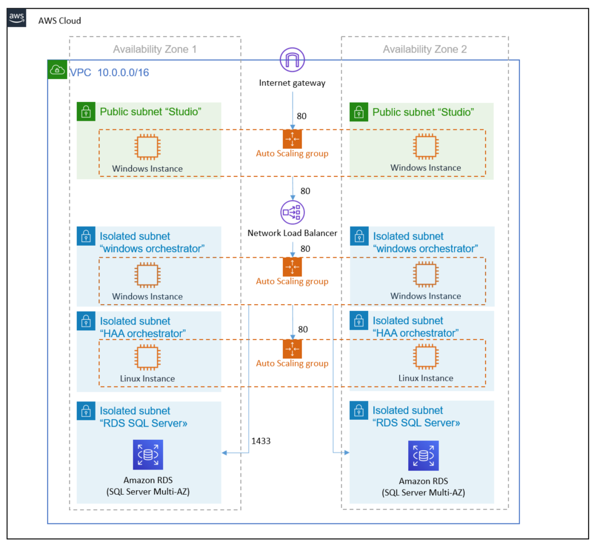

# How do I deploy UiPath base architecture?

This project provide a [CDK](https://docs.aws.amazon.com/cdk/latest/guide/home.html) app to deploy UiPath base architecture to AWS. The architecture deployed is shown below and is based on the UiPath architecture described in [this blog post](https://aws.amazon.com/blogs/architecture/field-notes-deploying-uipath-rpa-software-on-aws/)

## Great! So I just have to deploy this project and I've UiPath up and running on AWS?

No. This project provide a good quickstart to use UiPath on AWS, but you need to change it to your needs before using UiPath on AWS.

"Change" meaning for example: provide UiPath software+licence, use your EC2 keypair, set the correct TCP ports, check your desired hardware and software requirements and check if you prefer a different architecture (maybe you prefer an hybrid architecture where UiPath studio is installed on-premises)

Regarding UiPath servers, you may want (and I would recommend) that you prepare an image of your UiPath server, so that you can create them automatically and to be sure they're identical (no undocumented late night changes to fix an issue).

To do this you may want to use [EC2 Image Builder](https://docs.aws.amazon.com/imagebuilder/latest/userguide/what-is-image-builder.html), and [this blog](https://aws.amazon.com/blogs/mt/create-immutable-servers-using-ec2-image-builder-aws-codepipeline/) provide you a step by step example of EC2 Image Builder pipeline.

## Ok, but can I use this project to deploy something else?

Sure! This project is based on UiPath architecture, but is generic and simple enough to be adjusted to different deployments of UiPath, other tools or your custom application. On the other hand, if you need to deploy something significantly different from the architecture shown above, such as a serverless or container architecture, you should look somewhere else (maybe check the examples below).

## Wait a moment, where are UiPath robots?

They're not here at the moment, because you can either:
1) easily and quickly add them (for example, just duplicate/configure studio asg)
2) use on-premises robots (running against on-premises applications) and connect them to UiPath orchestrator on AWS.

## I like the idea but I'm new to CDK, where should I start?

[Read here what is CDK](https://docs.aws.amazon.com/cdk/latest/guide/home.html) and then [how to get started with CDK](https://docs.aws.amazon.com/cdk/latest/guide/getting_started.html).

## I prefer to learn by examples, where could I find them?

[https://docs.aws.amazon.com/cdk/latest/guide/examples.html](https://docs.aws.amazon.com/cdk/latest/guide/examples.html)

[https://github.com/aws-samples/aws-cdk-examples](https://github.com/aws-samples/aws-cdk-examples)

Don't forget to check the [API Reference](https://docs.aws.amazon.com/cdk/api/latest/docs/aws-construct-library.html), which also contains some examples:
[https://docs.aws.amazon.com/cdk/api/latest/docs/aws-construct-library.html](https://docs.aws.amazon.com/cdk/api/latest/docs/aws-construct-library.html)

## Some other useful tips to get started?

Sure! Don't forget to add CDK Intellisense to your IDE! Here you have some references:
[https://cdkworkshop.com/15-prerequisites/400-ide.html](https://cdkworkshop.com/15-prerequisites/400-ide.html)

## Any known limitation or issues of this three tier architecture ?

This configuration allows studio instances to connect directly to windows orchestrator instances (i.e. bypassing NLB) in addition to use NLB, you may want to remove this option. I left this configuration because can be useful to test/debug communication between instances.

I tested successfully this architecture in different AWS regions. The only known issue is that using this architecture with multi-az RDS in North Virginia will cause subnet issue.

## Useful commands

 * `cdk synth`       emits the synthesized CloudFormation template
 * `cdk deploy`      deploy this stack to your default AWS account/region
 * `cdk diff`        compare deployed stack with current state
